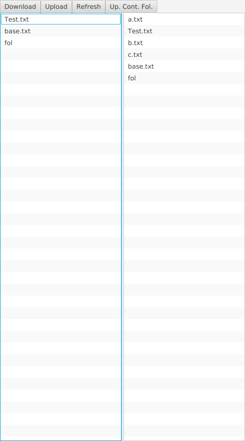

<h1>File Sharer</h1>  

<h2>Overview</h2>

 
    This program manages a file storage system that lets users upload and download their files.

<h2>Improvements over base instructions</h2>

    1. You can upload the contents of a folder (but not the folder itself).

    2. You can refresh the system in case you moved files while it was running.

<h2>How to run </h2>

    DO NOT MESS WITH THE FOLDERS THAT CAME IN THE ZIP FILE. You simply extract the zip file where you want to store it. You will want to start the server before the client. This can simply be done by compiling the server file then running it. You can then start the Client file using gradle with this format:

    gradle run --args="<em>computer_name</em> <em>path_to_folder_where_u_want_to_download_and_upload_from</em>

    You will be able to close the program by exiting the window.

  

<h2>Libraries and Ressources Used</h2>

    The project mainly used the javafx library  
    It also based on the ChatServer tutorial from module 7.

